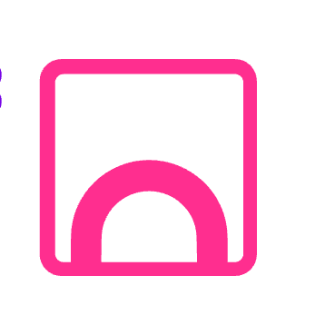

<div align="center">
  
  <h1>Nigel — Financial Literacy Platform</h1>
  <p><strong>A gamified, mobile-first learning platform teaching secondary school students real-world financial skills through interactive simulation.</strong></p>

  <p>
    
    
    
    
    
    
  </p>

  <p>
    Developed as a Student Sprint Project &middot; Sponsored by <a href="https://www.beyondencryption.com/">Beyond Encryption</a>
  </p>
</div>

---

## Table of Contents

- [Overview](#overview)
- [Monorepo Structure](#monorepo-structure)
- [Tech Stack](#tech-stack)
- [Features](#features)
- [Getting Started](#getting-started)
  - [Prerequisites](#prerequisites)
  - [Installation](#installation)
  - [Running the Project](#running-the-project)
- [Project Architecture](#project-architecture)
- [CI/CD & Security](#cicd--security)
- [Design Principles](#design-principles)
- [Roadmap](#roadmap)
- [Sponsor](#sponsor)
- [Licence](#licence)

---

## Overview

Financial literacy is a critical life skill absent from most secondary school curricula. **Nigel Junior** addresses this gap by delivering a safe, engaging simulation environment where students aged 11–16 can:

- Build and manage a realistic personal budget
- Understand payslips — gross pay, tax, and National Insurance
- Navigate unexpected life events and test financial resilience
- Earn badges and track progress across curriculum-aligned modules

The platform consists of two products sharing a single monorepo:

| Product | Description |
|---|---|
| **Mobile App** | Student-facing React Native (Expo) application |
| **Web Dashboard** | Teacher-facing React/Vite portal for class management and analytics |

---

## Monorepo Structure

```
nigel-learning-platform/
├── mobile/                    # Expo / React Native student app
│   ├── app/
│   │   ├── (auth)/            # Onboarding, role selection, login
│   │   ├── (student)/         # Student screens and tab navigation
│   │   │   ├── (tabs)/        # Dashboard, Map, Budget, Messages, Settings
│   │   │   ├── simulator.tsx  # Budget simulator
│   │   │   ├── lesson.tsx     # Lesson player
│   │   │   ├── quiz.tsx       # Quiz engine
│   │   │   └── ...
│   │   └── (teacher)/         # Teacher screens
│   ├── src/
│   │   ├── components/        # Shared UI components
│   │   ├── constants/         # Theme tokens, colours
│   │   ├── context/           # React context providers
│   │   ├── data/              # Static curriculum data
│   │   └── svg/               # Brand and illustration assets
│   └── assets/                # Images, fonts
│
├── web/                       # React / Vite teacher dashboard
│   ├── src/
│   │   ├── pages/             # Route-level page components
│   │   ├── components/        # Reusable UI components
│   │   ├── context/           # Theme, learning context
│   │   ├── data/              # Teacher and curriculum data
│   │   └── assets/            # Static assets
│   └── public/
│
├── .github/
│   └── workflows/
│       ├── ci.yml                      # Lint + format checks
│       ├── codeql.yml                  # CodeQL static analysis
│       └── vulnerability-check.yml     # npm audit (web + mobile)
│
├── package.json               # Root workspace config (npm workspaces + Turborepo)
└── turbo.json                 # Turborepo pipeline config
```

---

## Tech Stack

### Mobile (React Native)

| Technology | Version | Purpose |
|---|---|---|
| [Expo](https://expo.dev/) | ~54 | Managed React Native framework |
| [React Native](https://reactnative.dev/) | 0.81 | Cross-platform mobile UI |
| [Expo Router](https://docs.expo.dev/router/introduction/) | ~6 | File-based navigation |
| [NativeWind](https://www.nativewind.dev/) | ^4 | Tailwind CSS for React Native |
| [React Native Reanimated](https://docs.swmansion.com/react-native-reanimated/) | ~4 | Performant gesture animations |
| [Moti](https://moti.fyi/) | ^0.30 | Declarative animation primitives |
| [Lucide React Native](https://lucide.dev/) | ^0.563 | Icon library |
| [react-native-svg](https://github.com/software-mansion/react-native-svg) | 15.12 | SVG rendering |

### Web (Teacher Dashboard)

| Technology | Version | Purpose |
|---|---|---|
| [React](https://react.dev/) | 19 | UI library |
| [Vite](https://vitejs.dev/) | ^8 | Build tool and dev server |
| [React Router](https://reactrouter.com/) | ^7 | Client-side routing |
| [Tailwind CSS](https://tailwindcss.com/) | ^3 | Utility-first CSS framework |
| [Motion](https://motion.dev/) | ^12 | Animation library |
| [Recharts](https://recharts.org/) | ^3 | Data visualisation |
| [Lucide React](https://lucide.dev/) | ^0.577 | Icon library |

### Shared Tooling

| Tool | Purpose |
|---|---|
| [TypeScript](https://www.typescriptlang.org/) ~5.9 | Type safety across both apps |
| [Turborepo](https://turbo.build/repo) | Monorepo task orchestration and caching |
| [ESLint](https://eslint.org/) | Code linting |
| [Prettier](https://prettier.io/) | Code formatting |

---

## Features

### Student App (Mobile)

| Feature | Description |
|---|---|
| **Onboarding & Personalisation** | Role selection and personalisation flow tailoring the experience to each student |
| **Islands Learning Map** | Curriculum visualised as an explorable island map; each island is a topic module |
| **Lesson Player** | Interactive lesson screens with progress tracking and XP rewards |
| **Quiz Engine** | Multiple-choice quizzes with instant feedback and streak tracking |
| **Budget Simulator** | End-to-end simulation: choose a career, receive a payslip, allocate a budget, survive a life event |
| **Daily Challenge** | Time-limited challenges to reinforce daily engagement |
| **Progress & Badges** | XP, streaks, leaderboard rank, and badge collection |
| **Family Sharing** | Consent-gated invite system for parents to track student progress |
| **Dark / Light Mode** | Full theme support across all screens |

### Teacher Dashboard (Web)

| Feature | Description |
|---|---|
| **Class Overview** | Real-time view of active students, mission completions, and class averages |
| **Student Roster** | Individual student progress, badge count, and engagement metrics |
| **Analytics** | Charts and trend data on class performance over time |
| **Content Creation** | Tools to create and assign custom missions and quizzes |
| **Settings** | Profile management, notification preferences, and family sharing controls |

---

## Getting Started

### Prerequisites

| Requirement | Version |
|---|---|
| Node.js | v20+ |
| npm | v10+ |
| Expo Go | Latest (iOS / Android) |

### Installation

```bash
# Clone the repository
git clone https://github.com/danielsauuce/nigel-learning-platform.git
cd nigel-learning-platform

# Install all workspace dependencies from the root
npm install
```

### Running the Project

**Run both apps concurrently:**

```bash
npm run dev
```

**Run individually:**

```bash
# Web dashboard only (available at http://localhost:5173)
cd web && npm run dev

# Mobile app only (starts Expo dev server)
cd mobile && npm run dev
```

**Lint and format (always run from root before committing):**

```bash
npm run lint          # ESLint across all workspaces
npm run format        # Prettier across all workspaces
npm run format:check  # Verify formatting without writing changes
```

**Build:**

```bash
npm run build         # Turborepo builds both web and mobile
```

---

## Project Architecture

### Authentication & Role Separation

The platform uses a role-based model with two distinct user types:

- **Students** — Access the mobile app via a classroom code; no email or password required
- **Teachers** — Authenticate via email and password through the web dashboard

### Theme System

Both apps share a consistent design token system. The mobile app uses `constants/colors.ts` with `light` and `dark` theme objects consumed via `useTheme()`. The web app mirrors this with Tailwind custom tokens.

### Navigation

- **Mobile**: Expo Router file-based routing with three route groups — `(auth)`, `(student)`, `(teacher)`
- **Web**: React Router v7 with flat route definitions in `main.tsx`

### Data

All curriculum content (lessons, quizzes, island maps, simulator jobs and life events) is defined as static TypeScript data in each workspace's `data/` directory. This keeps the MVP free of backend dependencies while remaining straightforward to migrate to a live API.

---

## CI/CD & Security

All workflows trigger on push and pull request to `main` and `v0`.

| Workflow | Schedule | Description |
|---|---|---|
| **CI** (`ci.yml`) | Push / PR | Runs `npm run lint` and `npm run format:check` across all workspaces via Turborepo |
| **CodeQL** (`codeql.yml`) | Push / PR / Weekly (Sat) | Static analysis of TypeScript and JavaScript for security vulnerabilities |
| **Vulnerability Check** (`vulnerability-check.yml`) | Push / PR / Weekly (Mon 08:00 UTC) | `npm audit` on both `web/` and `mobile/`; fails on high or critical severity |

---

## Design Principles

| Principle | Implementation |
|---|---|
| **Mobile-first** | Designed for phone screens first; the web dashboard is a secondary teacher surface |
| **Engaging by default** | Gamification (XP, streaks, badges, leaderboards) built into the core learning loop |
| **Safe by design** | Zero connection to real financial data or APIs; all balances are simulated |
| **Minimal data collection** | Students identified by classroom codes only; no PII required to participate |
| **Accessible** | Semantic structure, Lucide icon components throughout (no emoji in production UI), full dark mode |

---

## Roadmap

| Feature | Status | Description |
|---|---|---|
| **AI Mentorship** | Planned | Integration of the Nigel Smart Data Agent for proactive, personalised budgeting tips |
| **Parent Portal** | Planned | Dedicated parent-facing view with guided conversation starters |
| **OpenDyslexic Support** | Planned | Accessibility font option for students with dyslexia |
| **Multi-language** | Planned | Localisation to ensure no student is excluded by language barrier |
| **Offline Mode** | Planned | Core lessons accessible without an active internet connection |

---

## Sponsor

**Beyond Encryption**

Nigel Junior is a Student Sprint Project developed in partnership with [Beyond Encryption](https://www.beyondencryption.com/).

> *"Nigel: Converting fragmented information into proactive, money-saving actions."*

Project Sponsor: Emily Plummer — Marketing Director
[emily.plummer@beyondencryption.com](mailto:emily.plummer@beyondencryption.com)

---

## Licence

The "Nigel" name, logo, and associated branding are trademarks of **Beyond Encryption**. This repository is part of a supervised Student Sprint Project and is not licensed for commercial use or redistribution without explicit written permission from Beyond Encryption.
